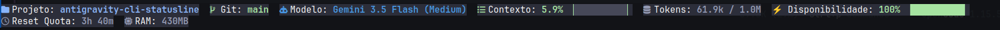

# ⚡ agy-statusbar

Barra de status **premium e funcional** para o **Agy CLI** (Antigravity CLI da Google), escrita em Python puro — sem dependências externas.

Exibe em tempo real: quota de API, contexto utilizado, modelo ativo, branch Git, RAM e muito mais — tudo em cápsulas visuais com emojis ou Nerd Fonts.

<p align="center">
  
</p>

---

## ✨ Recursos

| Item | Descrição |
|---|---|
| 📂 **Projeto** | Nome do diretório de trabalho atual |
| 🌿 **Git** | Branch atual + `*` se houver alterações pendentes |
| 🤖 **Modelo** | Modelo ativo com cor específica por provedor (Gemini 🔵, Claude 🟠, GPT 🟢) |
| 📊 **Contexto** | % do context window utilizado + barra de progresso com alerta de cores |
| 🪙 **Tokens** | Tokens usados / tamanho total do context window |
| ⚡ **Disponibilidade** | Quota real restante do modelo ativo (via daemon local) |
| ⏳ **Reset Quota** | Tempo até o próximo reset de quota |
| 💻 **RAM** | Consumo de memória do processo do Agy CLI |

### 🎨 Tema Capsule (padrão)
Cada item é renderizado como uma cápsula visual `(icon Label: Valor)` com fundo sutil e cores semânticas:

```
(📂 Projeto: meu-app ) (🌿 Git: main ) (🤖 Modelo: Claude Sonnet 4.6 (Thinking) )
(📊 Contexto: 5.2% ▕░░░░░░░░░░▏ ) (🪙 Tokens: 55.0k / 1.0M ) (⚡ Disponibilidade: 80% ▕████████░░▏ ) (⏳ Reset Quota: 3h 29m ) (💻 RAM: 3MB )
```

### 🔠 Suporte a Nerd Fonts
O projeto suporta nativamente [Nerd Fonts](https://www.nerdfonts.com/) para exibir ícones de terminal minimalistas e elegantes ao invés de emojis coloridos.

Você pode ativá-lo respondendo `S` no instalador interativo, ou manualmente no `settings.json` definindo `"nerdFonts": true`:

```json
"ui": {
  "statusline": {
    "nerdFonts": true
  }
}
```

#### 📦 Instalação das Fontes

**No Linux (Fedora/KDE/Ubuntu):**
1. Baixe o pacote de sua fonte preferida (ex: `JetBrainsMono.tar.xz`) na página de [Releases do Nerd Fonts](https://github.com/ryanoasis/nerd-fonts/releases).
2. Extraia os arquivos `.ttf` para a sua pasta de fontes locais: `~/.local/share/fonts/` (ou `/usr/share/fonts/` para sistema inteiro).
3. Atualize o cache de fontes:
   ```bash
   fc-cache -fv ~/.local/share/fonts/
   ```
4. **Configuração no KDE (Konsole):** Vá em *Configurações* -> *Editar perfil atual* -> *Aparência* e selecione `JetBrainsMono Nerd Font` (tamanho recomendado: 11).

**No Windows (Windows Terminal / VS Code):**
1. Baixe a fonte `.zip` desejada em [nerdfonts.com](https://www.nerdfonts.com/font-downloads).
2. Extraia o arquivo, selecione os arquivos de fonte, clique com o botão direito e selecione **"Instalar para todos os usuários"**.
3. **No Windows Terminal:** Abra as Configurações (Ctrl + ,), clique no seu Perfil (ex: PowerShell ou Ubuntu), vá em *Aparência* -> *Fonte* e escolha a sua Nerd Font (ex: `JetBrainsMono NFM`).
4. **No VS Code:** Vá em Configurações (Ctrl + ,), procure por `Terminal Font Family` e adicione `'JetBrainsMono Nerd Font'` na frente das demais.

---

## 🚀 Instalação

### One-Liner
```bash
git clone https://github.com/rodrigomeneguet/agy-statusbar.git /tmp/agy-statusbar \
  && cd /tmp/agy-statusbar \
  && python3 install.py < /dev/null \
  && rm -rf /tmp/agy-statusbar
```

### Manual
1. Copie `statusline.py` para `~/.gemini/statusline.py`
2. Adicione ao `~/.gemini/antigravity-cli/settings.json`:

```json
{
  "statusLine": {
    "type": "command",
    "command": "python3 /home/SEU_USUARIO/.gemini/statusline.py",
    "enabled": true
  }
}
```

---

## ⚙️ Configuração

### Personalizar itens exibidos

No `~/.gemini/antigravity-cli/settings.json` ou `~/.gemini/settings.json`:

```json
{
  "ui": {
    "language": "pt",
    "statusline": {
      "theme": "capsule",
      "nerdFonts": false,
      "progressBarWidth": 10
    },
    "footer": {
      "items": [
        "project-path",
        "git-branch",
        "model-name",
        "context-used",
        "token-count",
        "quota",
        "quota-reset-countdown",
        "memory-usage"
      ]
    }
  }
}
```

### Opções de `theme`

| Valor | Aparência |
|---|---|
| `capsule` | `(icon Label: Valor)` — padrão |
| `retro` | `[ icon Label: Valor ]` com bordas `╔╗` |
| `minimal` | `icon Label: Valor` sem decoração |

### Idiomas disponíveis (`language`)

| Código | Idioma |
|---|---|
| `pt` | Português (padrão) |
| `us` | English |
| `zh-tw` | 繁體中文 |
| `jp` | 日本語 |

---

## 🔍 Como funciona a Quota Real

O script detecta automaticamente o processo `agy` em execução via `ps auxww`, extrai a porta do servidor local gRPC e consulta o endpoint `GetUserStatus` para obter os dados reais de quota por modelo — sem precisar de tokens externos ou configuração adicional.

O resultado é cacheado em `~/.gemini/tmp/real_quota_cache.json` por 30 segundos para não impactar a performance.

---

## 🎨 Cores semânticas

As cores mudam automaticamente de acordo com o nível:

| Faixa | Cor | Significado |
|---|---|---|
| ≥ 75% | 🟢 Verde | Seguro |
| 50–74% | 🟡 Amarelo | Atenção |
| 25–49% | 🟠 Laranja | Alerta |
| < 25% | 🔴 Vermelho | Crítico |

- **Quota / Disponibilidade:** quanto maior, melhor (verde = muito quota)
- **Contexto utilizado:** quanto menor, melhor (verde = pouco uso)

---

## 🤝 Créditos

- Inspirado pela implementação de quota local do repositório [AndyAWD/antigravity-cli-statusline](https://github.com/AndyAWD/antigravity-cli-statusline)
- Portado e expandido com tema capsule, suporte multilíngue, barra de progresso e cache por conversa

---

## 📄 Licença

MIT
